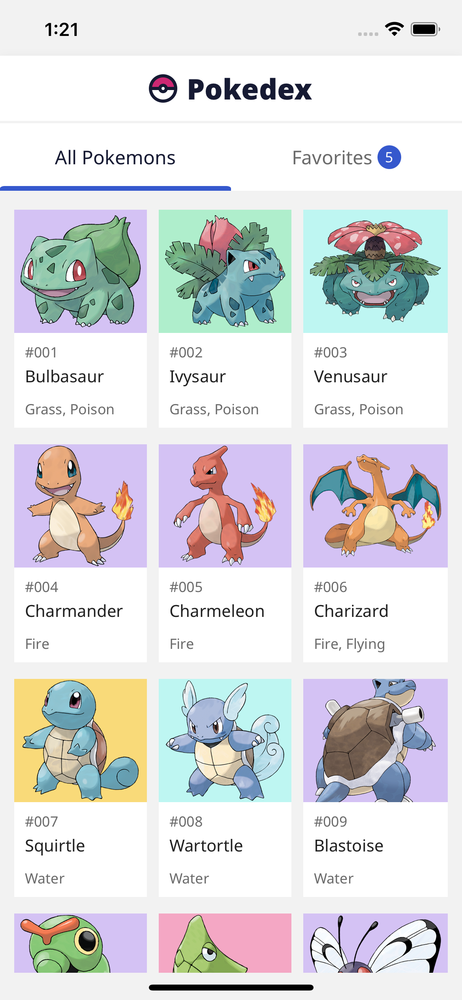
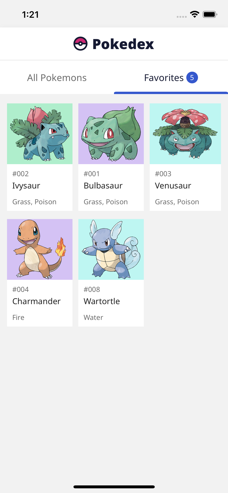
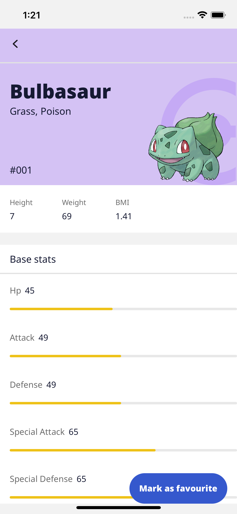

# Pokedex

This Pokedex app is built with React Native and uses Context Api for state management.

Pokedex is a mobile app that allows interacting with pokemons.

Pokedex consumes Pokémon API to display pokemons.

## Screenshots

### Splash


### Home & Favourites

&nbsp;&nbsp;&nbsp;&nbsp;&nbsp;&nbsp;&nbsp;&nbsp;

### Pokemon Details Screen



## Test locally

To install all dependencies, you need to run the following command:

```bash

git clone https://github.com/lexican/pokedex-react-native.git
cd pokedex-react-native

yarn install
npx react-native start
npx react-native run-android

or

npx react-native run-ios

```
